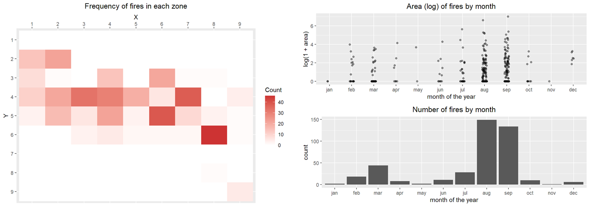

# Predicting forest fires with weather data

On the left: distribution of forest fires across several land sectors of the Montesinho natural park. On the right: breakdown of the distribution of forest fire areas over different months.

## Report
[**The full report is available here.**](https://manuelemacchia.com/forest-fires/) Weather sensor data and source code in R are available in this repository.

## Overview
Forest fires are a major environmental problem. It is an increasingly important concern to prevent wildfires or, at least, limit the damage they cause by detecting their occurrence as soon as possible.

The goal of this project is to **predict the burned area of forest fires by analyzing weather conditions** known to affect fire occurrences, such as humidity and temperature. Unlike other systems, weather data may be easily collected in real time employing cheap sensors, therefore we use this kind of readily accessible data for our prediction task.

The data consists of a collection of 517 records, each corresponding to a fire occurred in the Montesinho natural park, in the northeast region of Portugal, from January 2000 to December 2003.

## Methodology
We build several **linear regression** models using the data at our disposal and perform an in-depth analysis and evaluation of their performance and goodness of fit. Then, we solve a simplified version of the problem, namely predicting whether a forest fire is bigger or smaller than a given threshold. We use **logistic regression** models to tackle this binary classification task. We go back to the original regression problem and adopt a non-linear model, a **random forest**, and compare its performance to that of linear models. Finally, we build a random forest classifier to solve the simplified binary classification task and compare it to the logistic regression model.

## References
- Cortez, Paulo, and Aníbal Morais. 2007. "A Data Mining Approach to Predict Forest Fires Using Meteorological Data." In Proceedings of the 13th EPIA 2007 - Portuguese Conference on Artificial Intelligence, December, Guimaraes, Portugal, 512–23.
- Taylor, Stephen W., and Martin E. Alexander. 2006. "Science, Technology, and Human Factors in Fire Danger Rating: The Canadian Experience." International Journal of Wildland Fire 15 (1): 121. https://doi.org/10.1071/WF05021.
